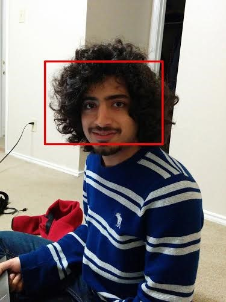
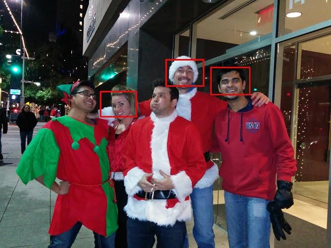

# FaceTagger
Google Glass Face Detection Demo

## Running FaceTagger Application
1. Go to the path of folder apk.
2. run the command "adb install launchy.apk" to install the launch setup for the application
3. run the command "adb install FaceTagger.apk" to install the application.
4. Access the google glass. 
5. Swipe forward on glass to access the application.
6. Tap to get into the application. Application would start when the camera gets activated.
7. Face towards any source of faces(e.g. real people, images, video)
8. The application would detect face and draw a red rectangle capturing the faces detected.

## Other method of installing the application (Alternative to steps 1- 3)
1. Import the projects "FaceTagger" and "Launchy" in eclipse from the folder "Code".
2. Right click on project "Launchy" and select run as android application to deport the launch environment to Google Glass.
3. Right click on project "FaceTagger" and select run as android application to deport the app to Google Glass.

## Note and Extra Credits
You either need to write a voice based launcher for your glass application. Otherwise use supplementary launcher such as [launchy](https://github.com/kaze0/launchy).

## License

MIT: http://vineetdhanawat.mit-license.org/